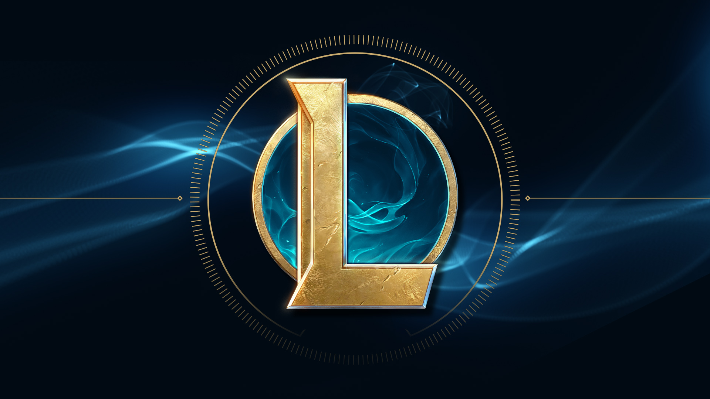

# League of Legends Capstone

<!-- Add buttons here -->

<!-- Describe your project in brief -->
Link to where we acquired the original dataset from: (https://developer.riotgames.com/)
# Project Summary
League of Legends is the largest eSport in the world that generated $1.75 billion dollars for Riot Games in 2020 alone. An average professional match can last anywhere between 45-60 minutes, and we are creating a model that predicts the outcome of a match by the 20 minute mark. This can be utilized by professional analysts of the game, applied to other sports, and help game developers discover any imbalances of the game mechanics.

# Executive Summary
<!-- Add a demo for your project -->
### Acquisition
- Acquired over 20,000 High ranked League of Legends players matches through Riot's API.

### Exploration
- We found the number of tower objectives lost by a team was a key driver to predicting the outcome of a match.

### Modeling
- Our top model is a Random Forrest Classifier.

### Conclusion
- We discovered that teams that focus on the objectives of the game have a higher winrate.

### Project Goals

- Create a model that will predict the probability of winning for each team by the 20 minute mark of a LoL match using live data scraped off of Riot’s api.

### Data summary
- The data is only from the north American Server
- The data contains pro players, and other top performers of the game, The lowest ranking players are in masters, which is still the top .15% of players.

The data was pulled from the riot api using names that were gathered from webscraping two popular League of legends sites called op.gg (https://na.op.gg/ranking/ladder/) and trackingthepros (https://www.trackingthepros.com/players/na/) op.gg was used to grab roughly the top 3000 players in the ranked ladder, and trackingthepros was used to grab the names of the current professional league of legends players.

### Recommendations
- Players should focus their attention on grouping and pushing towers,

### Problem Statement:
League of Legends is growing and with that comes increasing demands from coaches, analysts, casters, and the game developers. Coaches, analysts, and casters always need good data to make key decisions and develop better strategies and deeper understandings of what is the most important factors of a game. Game developers need to keep the game fair and fun, to continue developing their playerbase to stay at the top of esports and gaming popularity.

### Proposed solution:
Create a machine learning model that can accuratly determine the team that will win based on certian features of a game, and what features have the largest impact on a teams success.

# Table of contents
<!-- Add a table of contents for your project -->

- [Project Title](#project-title)
- [Executive Summary](#executive-summary)
- [Table of contents](#table-of-contents)
- [League of legends Dictionary](#League-of-legends-dictionary)
- [Data Dictionary](#data-dictionary)
- [Data Science Pipeline](#data-science-pipline)
    - [Acquire](#acquire)
    - [Prepare](#prepare)
    - [Explore](#explore)
    - [Model](#model)
    - [Evaluate](#evaluate)
- [Conclusion](#conclusion)
- [Given More Time](#given-more-time)
- [Recreate This Project](#recreate-this-project)
- [Footer](#footer)

# League of Legends Common Termonology
[(Back to top)](#table-of-contents)
<!-- Drop that sweet sweet dictionary here-->

| League terms    | Plain explination                                               | 
|:----------------|:----------------------------------------------------------------|
| Riot            |Riot games is the company that owns league of legends.           |
| Kill            |Given to the player that deals the final blow. Rewards gold.     |
| Assist          |Given to the player(s) that help in a kill. Rewards some gold.   |
| Death           |When players lose all health. Temporarily taken out of game.     |
| Level           |Each level makes your character stronger. Max level: 18.         |
| Experience(xp)  |Used to level up.Experienced gained for being near the action.   |
| Dragon          |A neutral monster that both teams can take. Gives bonuses.       |
| herald          |A neutral monster that both teams can take. Takes towers.        |
| Baron           |A neutral monster that both teams can take. Gives bonuses.       |
| Champion        |A playable character in League of legends.                       |
| Summoner        |A name for the players, each player is a summoner.               |
| Summoners rift  |The map that competative games of league are held on.            |
| Lane            |There are three lanes on summoners rift and each has differences.|
| Jungle          |A role that has no lane but assists the other lanes.             |
| Minion          |Small ai controlled fighters that give gold when killed.         |
| Monster         |Normally stronger then minions they spawn in the jungle.         |
| Tower           |A structure in the game that defends itself.                     |
| Wards           |An item that gives vision in the jungle, and in bushes.          |
| Crowd Control   |A structure in the game that defends itself.                     |
| Inhibitor       |A structure that when taken strengthens the other teams minions. |
| Nexus           |Goal of players to take the enemy nexus. How you win.            |
| Abilities       |spells or special moves given to each character.                 |
| Gold            |Players get gold by killing things on the map.                   |
| Items           |Players use gold to buy items to make themselves stronger.       |
| Armor           |Reduces damage from physiscal attacks.                           |
| Magic Resist    |Reduces damage from magic attacks.                               |
| Magic damage    |Increases damage of abilities, and sometime attacks.             |
| Physical damage |Increses damage of attacks, and sometimes abilities.             |
| True Damage     |Ignores armor and magic resist.                                  |
| Blue Team       |Blue team starts the game at the bottom left.                    |
| Red Team        |Red team starts the game at the top right.                       |
| puuid           |An encrypted id given to each player on the riot api.            |

# Data Dictionary
[(Back to top)](#table-of-contents)
<!-- Drop that sweet sweet dictionary here-->

| Feature                    | Datatype                | Definition   |
|:----------------------|:------------------------|:-------------|
| RedTeamKills|int64|Gives a total of the red teams kills.|
| BlueTeamKills|int64|Gives a total of the blue teams kills|
| RedTeamTowerKills|int64|Gives a total of the number of towers taken by the red team|
| BlueTeamTowerKills|int64|Gives a total of the number of towers taken by the blue team|
| RedTeamTowerAssists|int64|Gives the total number of assists on the red team|
| BlueTeamTowerAssists|int64|Gives the total number of assists on the blue team|
| RedTeamAvgLvl|int64|Takes the mean level of all the players on the red team|
| BlueTeamAvgLvl|int64|Takes the mean level of all the players on the blue team|
| RedTeamGoldSpent|int64|Gives a total amount of gold spent by the red team|
| BlueTeamGoldSpent|int64|Gives a total amount of gold spent by the blue team|
| RedTeamDragons|int64|Gives a total number of dragons killed by the red team|
| BlueTeamDragons|int64|Gives a total number of dragons killed by the blue team|
| RedTeamHeralds|int64|Gives a total number of heralds killed by the red team|
| BlueTeamHeralds|int64|Gives a total number of heralds killed by the blue team|
| RedTeamBarons|int64|Gives a total number of barons killed by the red team|
| BlueTeamBarons|int64|Gives a total number of barons killed by the blue team|
| RedTeamInhibTaken|int64|Gives a total number of inhibitors taken by the red team|
| BlueTeamInhibTaken|int64|Gives a total number of inhibitors taken by the blue team|

# Data Science Pipeline
[(Back to top)](#table-of-contents)
<!-- Describe your Data Science Pipeline process -->
Following best practices I documented my progress throughout the project and will provide quick summaries and thoughts here.

### Planning
- Communicate with teammates about strengths and weaknesses to find team members that can lead specific sections in the work.
- Clearly outline and define our goal as being a teams chance of winning at the 20 minute mark in a league of legends game.
- Build out a trello board that the team can reference that contains an outline of information we will use when completing the rest of the datascience pipeline.

**Link to Trello board** : https://trello.com/b/lW8DJA3k/project-planning

### Acquire
[(Back to top)](#table-of-contents)
<!-- Describe your acquire process -->
- Webscraped two sites to gather summoner names (username) for the Riot games developer api.
- Used the summoner names to get a unique puuid, which is league of legends unique identifier for players.
- Using the puuid we were able to get the matchid's of the last 100 games for each of the players.
- After we had the matchid's we pulled in json files for each match and the timeline of events that happened in the match.
### Prepare
[(Back to top)](#table-of-contents)
<!-- Describe your prepare process -->
- From json files that were gathered from the Riot api, functions were created that would build a dataframe of both team, and individual stats from the 20 minute mark.
- Columns were renamed to change the team id's of 100 to blue and 200 to red.
- Replaced nulls with zero.
- Split data for exploration.

**Feature Engineering**

- Gold difference
- MVP stats

### Explore
[(Back to top)](#table-of-contents)
<!-- Describe your explore process -->
- Goal: Visualize the data and explore possible relationships. The use of visuals and statistics tests aided in the help to answer my questions. 
**Hypothesis**
- The amount of assists affected the outcome of the game

#### Statistical testing:
- There was a low correlation of -.03 between wards and the result of the game
- We are 95% confident that 22 or more assists had a difference in the outcome of the game with a negative p value

### Model
[(Back to top)](#table-of-contents)
<!-- Describe your modeling process -->
- Split the data into X and y groups and into train and test datasets.
- Utilized cross validation and grid search.
- Created optimized random forest classifier.
- Refit the best performing model on our entire train dataset.

**Model accuracy**

- ~95% mean cross validation accuracy.
- Refit the best performing model on our entire train dataset.

### Evaluate
[(Back to top)](#table-of-contents)
<!-- Describe your evaluation process -->
**Test Accuracy**
- Waiting for final draft
**Test Precision**
- Waiting for final draft
**Test Recall**
- Waiting for final draft
# Conclusion
[(Back to top)](#table-of-contents)
<!-- Wrap up with conclusions and takeaways -->

# Given More Time/ Next steps
[(Back to top)](#table-of-contents)
<!-- LET THEM KNOW WHAT YOU WISH YOU COULD HAVE DONE-->
- Make a live dashboard that updates every 5 minutes updating the chances of winning.
# Recreate This Project
[(Back to top)](#table-of-contents)
<!-- How can they do what you do?-->
- Make a copy of our final.csv in order to avoid acquiring through the riot api.
- Use the **rename_cols** function in our prepare.py.
- Continue working though the project using the functions created to help along the way.
# Footer
[(Back to top)](#table-of-contents)
<!-- LET THEM KNOW WHO YOU ARE (linkedin links) close with a joke. -->

#### Individual team members github links:
- Chris Everts: https://github.com/chriseverts
- Johnathon Smith: https://github.com/johnathon-smith
- Joshua Bryant: https://github.com/Joshua-C-Bryant
- Joshua Chaves: https://github.com/joshuamchavez2
- Jared Vahle: https://github.com/JaredVahle

#### Individual team members linkedin links:
- Chris Everts: https://www.linkedin.com/in/chris-everts
- Johnathon Smith: https://www.linkedin.com/in/smith-johnathon/
- Joshua Bryant: https://www.linkedin.com/in/joshcbryant/
- Joshua Chaves: https://www.linkedin.com/in/joshuamchavez2/
- Jared Vahle: https://www.linkedin.com/in/jared-vahle-data-science/
